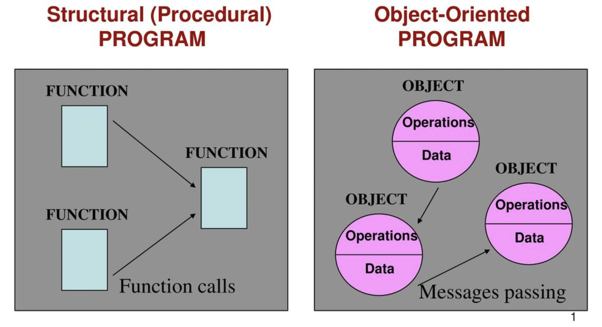

# Java Basics


## 0. Getting Started 🚀

### Pre-request

- Install JDK
Run bellow command in terminal window to verify you installed jdk correctly.
```shell
java --version
```
- Install IDE
  - [IntelliJ IDEA](https://www.jetbrains.com/idea/download/#section=mac)
  - [Eclipse](https://www.eclipse.org/downloads/)


### Create the source file
- Open a text editor, type in code which defines a class HelloWorld and then save it int a file HelloWorld.java
- file and class name are case sensitive and must be matched exactly(except .java part)

**Example Code: HelloWorld.java**
```java
// The HelloWorld class implements an application
// that displays "Hello World!" to the standard output
public class HelloWorld {
	public static void main(String[] args) {
		//Display "Hello World!"
		System.out.println("Hello World!");
	}
}
```
### Compile the program
- compile HelloWrold.java by using the following command:
```shell
javac HelloWorld.java

# It generates a file named HelloWrold.class
```

### Run the program
- run the code through:
```shell
java HelloWorld

#It will return Hello World!
```
- Note that the command is java, not javac, and you refer to HelloWorld, not HelloWorld.java or HelloWorld.class

😢 Exception in thread "main" java.lang.NoClassDefFoundError: HelloWorld

If you see this error, you may need to set the environment variable CLASSPATH


## 1. Data Types

### Primitive Types
- byte : 8bits (1byte)
- char : 16bits (2byte)
- short : 16bits (2byte)
- int : 32bits
- float : 32bits
- long : 64bits
- double : 62bits
- boolean : 1bit

boolean 只有两个值：true、false，可以使用 1 bit 来存储，但是具体大小没有明确规定。JVM 会在编译时期将 boolean 类型的数据转换为 int，使用 1 来表示 true，0 表示 false。JVM 支持 boolean 数组，但是是通过读写 byte 数组来实现的。

> 위 내용은 cyc note 에 적혀있는 내용인데, 나름대로 한국어로 번역해 보았다.
>
> boolean은 true, false 에만 해당하기 때문에, 1bit 만있으면 저장할 수 있다, 하지만 정확한 크기는 정해지지 않았다.
> JVM이 컴파일 될 때 boolean 타입은 int 타입으로 바뀌게되고, 1은 true, 0은 false를 의미하게 된다. JVM은 boolean 배열을 지원하지만, 실제로는 byte 배열을 통해 구현된다.


 📚[Primitive Data Types](https://docs.oracle.com/javase/tutorial/java/nutsandbolts/datatypes.html)  
 📚[Package java.lang](https://docs.oracle.com/javase/9/docs/api/java/lang/package-use.html)  
 📚[The Java® Virtual
Machine Specification](https://docs.oracle.com/javase/specs/jvms/se8/jvms8.pdf)  
 ❓ [Why single character file saved as 8bits(1byte) not 16bits? - Answers about UTF-16 UTF-8](https://stackoverflow.com/questions/24095187/char-size-8-bit-or-16-bit)  
 <br>
 

### Wrapper Class


Primitive types have corresponding wrapper class, and the assignment between basic types and their corresponding wrapper class is done using autoboxing and unboxing. 

- Autoboxing: Automatic conversion of primitive types to the object of their corresponding wrapper classes is known as autoboxing. (i.e. conversion of int to Integer, long to Long, double to Double etc.)

Exmple:
```java
import java.util.ArrayList;
class Autoboxing
{
    public static void main(String[] args)
    {
        char ch = 'a';
  
        // Autoboxing- primitive to Character object conversion
        Character a = ch;
  
        ArrayList<Integer> arrayList = new ArrayList<Integer>();
  
        // Autoboxing because ArrayList stores only objects
        arrayList.add(25);
  
        // printing the values from object
        System.out.println(arrayList.get(0));
    }
}

// Output will be '25'
```

- Unboxing: It is just the reverse process of autoboxing. Automatically converting an object of a wrapper class to its corresponding primitive type is known as unboxing. For example (i.e.conversion of Integer to int, Long to long, Double to double, etc.)

Example:
```java
// Java program to demonstrate Unboxing
import java.util.ArrayList;
  
class Unboxing
{
    public static void main(String[] args)
    {
        Character ch = 'a';
  
        // unboxing - Character object to primitive conversion
        char a = ch;
  
        ArrayList<Integer> arrayList = new ArrayList<Integer>();
        arrayList.add(24);
  
        // unboxing because get method returns an Integer object
        int num = arrayList.get(0);
  
        // printing the values from primitive data types
        System.out.println(num);
    }
}

// Output will be '24'
```

📚[Autoboxing and Unboxing](https://docs.oracle.com/javase/tutorial/java/data/autoboxing.html)  
📚[The Numbers Classes](https://docs.oracle.com/javase/tutorial/java/data/numberclasses.html)  
<br>  

### Buffer Pool


## 2. Object-Oriented programming

### Procedural vs. Object-Oriented Programming 

- The unit in procedural programming is funciton, and unit in OOP is class.
- Procedural programming concentrates on creating function, while OOP starts from isloating the classes, and then look for the methods inside them.
- Procedural programming sperates the data of the program from the operations that manipulate the data, while OOP focus on both of them.




### Concepts of Class and Object

- "Class" refers to a blueprint. It defines the variables and methods the object support.
- "Object" is an instance of a class. each object has a class which defines its data and behavior.

### Class Members

- A class can have three kinds of members:
  - **fields**: data variables which determine the status of the class or an object (e.g. )
  - **methos**: executable code of the class built from statemets. It allows us to manipulate/change the status of an object or access the value of the data member
  - **nested classes and nested interfaces** 

**Sample class**
```java
class Pencil {
  public String color = "red";
  public int length;
  public float diameter;
  
  pulbic static long nextID = 0;
  
  public void setColor (String newColor) {
  	color = newColor;  
  }
  
  public void getColor() {
  	return color;
  }

```
